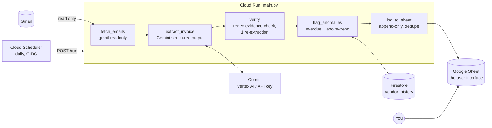

# Architecture

## Flow



```
 Cloud Scheduler ──POST /run──▶ Cloud Run (FastAPI, main.py)
                                 │
   Gmail ──read-only──▶ fetch_emails ─▶ extract_invoice ─▶ verify ─▶ flag_anomalies ─▶ log_to_sheet
                                             │  ▲            │  ▲        │   ▲              │
                                             ▼  │            ▼  │        ▼   │              ▼
                                          Gemini (Vertex)  re-extract  Firestore        Google Sheet
                                                             once      vendor_history   (append-only)
```

| Step | Module | Reads | Writes |
|---|---|---|---|
| `fetch_emails` | `agent/tools.py` | Gmail (`gmail.readonly`) or `data/sample_emails/` | — |
| `extract_invoice` | `agent/tools.py` | email text → Gemini with `InvoiceFields` response schema | — |
| `verify` | `agent/tools.py`, `agent/parsing.py` | email text (regex evidence) | — |
| `flag_anomalies` | `agent/tools.py`, `agent/storage.py` | vendor history | appends to vendor history |
| `log_to_sheet` | `agent/storage.py` | existing sheet rows (for dedupe) | appends one sheet row |

`flag_anomalies` runs **before** `log_to_sheet` so the row carries `flagged` and
`flag_reasons`. The sheet is append-only, so a row is never edited after it is
written.

## Components

**Extraction.** Gemini is called with `response_schema=InvoiceFields`, so it
returns typed JSON (vendor, amount, currency, due_date, paid, autopay) rather
than prose. `paid` means the email confirms the charge already happened;
`autopay` means it says this amount *will* be charged automatically.
`currency.to_base` converts the amount to INR (`amount_base`), using a static
table by default or, with `FX_SOURCE=live`, the day's ECB rates from Frankfurter
(fetched once a day, with the static table as fallback).

**Batching.** The batch pipeline and eval send every email in one Gemini
request (each in its own `=== EMAIL n ===` block, with `response_schema` a list of
`BatchInvoice`, i.e. `InvoiceFields` + `email_id`). Results are matched back by
`email_id`, so an email the model skips fails alone. Verify then re-extracts all
the emails with issues in one more request, each with its own hint. A run costs
at most two requests (more only past `GEMINI_BATCH_SIZE` emails). Because verify
checks every field against that email's own text, a value that leaks from one
email into another is caught like any other mistake.

**Verify (self-correction).** `parsing.find_issues` checks each field against
what is literally in the email:
- amount: must equal a number written next to a currency marker (₹, Rs., $, USD, …)
- currency: must match the markers present
- vendor: must be named in the email (body or sender)
- due_date: must equal a date in the email (several formats; `12-10-2026` is tried as DMY and MDY)

If there are any issues, extraction is re-run **once**, with those issues as the hint.
Whichever attempt has fewer issues is kept. Anything unresolved is marked
`needs_review`: it still goes into the sheet, but not into history, so a bad
extraction can't skew future averages.

**Anomalies.** `detect_anomalies` is a pure function; `flag_anomalies` wraps it
with history I/O.
- *overdue*: `due_date < today`, not `paid`, and not `autopay` (an auto-charged
  bill past its date is not something the user forgot to pay).
- *above-trend*: `amount_base` is more than `ANOMALY_THRESHOLD_PCT` (20%) above
  the mean of the vendor's bills in the previous `ANOMALY_WINDOW_MONTHS` (3)
  calendar months, with at least `ANOMALY_MIN_HISTORY` (2) prior bills.

Every reason quotes its inputs, e.g.
`₹1,240.50 is 38% above 3-month avg of ₹900 (3 bills; threshold 20%)`.

**State.**
| State | Prod | Dev fallback |
|---|---|---|
| Vendor history | Firestore `vendor_history/{vendor_key}` → `{vendor, entries: [{due_date, amount_base, source_id}]}` | `data/history.json` (same shape, keyed by `vendor_key`) |
| Bill log | Google Sheet (first worksheet) | `data/bills.csv` |

Sheet columns: `logged_at, vendor, amount_base, base_currency, due_date, paid,
flagged, flag_reasons, needs_review, source_id, autopay`. (`autopay` was added
last so an existing sheet's columns stay aligned. Add the header cell by hand
if your sheet predates it.) The row is deduplicated on
`(vendor_key, due_date)`.

**Hosting.** One Cloud Run service, with Cloud Scheduler calling `POST /run` daily.
The service account needs Vertex AI user, Firestore user, and Secret Manager
accessor roles, plus Editor on the one Sheet shared with it. The Gmail OAuth
token is mounted from Secret Manager.

## Safety boundary

The agent is **read-only on the inbox** and its only writes are **appends**: rows
to the sheet, and entries to its own history. This is enforced by what exists,
not by prompting:

- Gmail is authorized with `gmail.readonly` only. The token cannot send, delete,
  label, or mark mail as read.
- The Sheets credential is scoped to `spreadsheets`, and the code only calls
  `append_row`. Values are written `RAW` (and CSV cells are escaped), so
  email-derived text can't run as a formula.
- There is no payment tool, no delete tool, and no HTTP endpoint that edits
  anything. To change what the agent can do, you'd have to add code and a new
  OAuth scope; a prompt can't do it.

The ADK instruction restates the boundary, so in the ReAct loop the model
declines such requests rather than trying them.

## Two ways to run the same tools

- `main.py` / `run.py` → `agent/pipeline.py`: a fixed, deterministic order, used for batch runs and Cloud Run.
- `adk run agent` → `agent/agent.py`: the ADK ReAct loop over the same five tools; the model picks the order, guided by the instruction.
